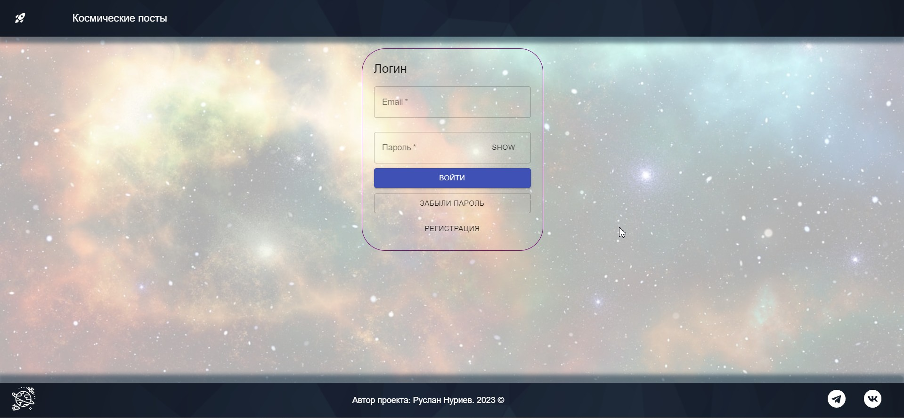
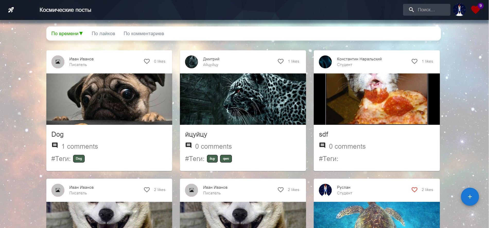
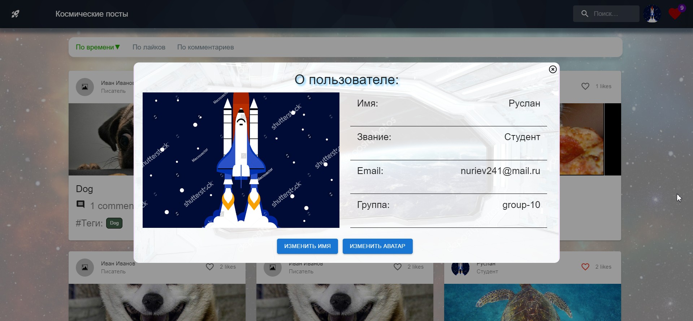
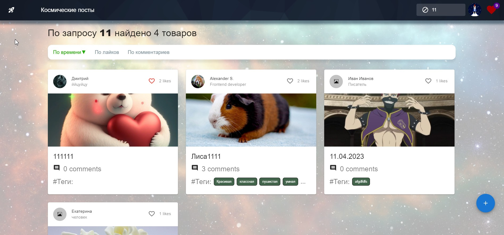
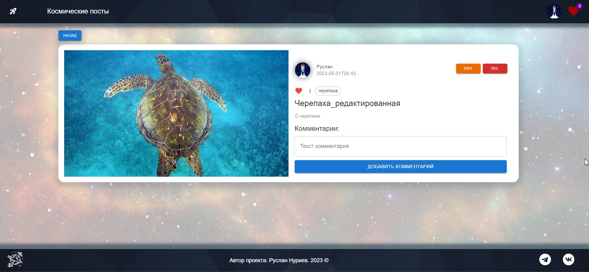
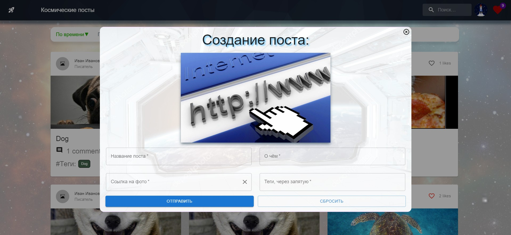

# Космические посты

### [Сайт с постами](https://gor241.github.io/post)

## Screenshots:
 | 
--- | ---
 | 
--- | ---
 | 

## Функциональность:
- SPA с постами
- Отработка взаимодействия с кастомным серверным api
- Все формы на сайте упраляемые компоненты
- Реализованн вход/регистрация на сайт (реализован паттерн для
email с использованием регулярного выражения)
- Функционал 'Забыл пароль' ( мы вводим email от
своего аккаунта. Система отправит на нашу почту пароль, мы его введём с новым паролем
и произведём вход.)
- В шапке нам становится доступен поиск среди постов, меню пользователя и иконка избранное
- Добавление и удаления карточек 
- Добавление и удаление лайков/комментариев
- Использованно как redux(toolkit), так и context
- При нажатии на аватар открывается меню, в котором можно открыть профиль,
'все созданные посты' и выйти.
- При нажатии на
'Открыть профиль' открывается модальное окно с данными о нашем
пользователе. Также здесь две кнопки отвечающие за изменение имени и аватара.
- При нажатии на
'Открыть посты', откроются все, ранее созданные нами посты.
- При нажатии на иконку избранное, мы переходим
на страницу 'Избранное' (все посты, на которые мы поставили лайк)
- При нажатии на пост, мы попадаем на страницу поста. Если пост создан пользователем,
который нажал на пост, становятся доступны кнопки : Редактирование и Удаление
поста
- При нажатии редактирование поста, открывается модальное окно, в котором мы
можем редактировать этот пост. Реализовано автоматическое добавление данных
об этом посте в формы
- На странице поста имеется возможность, добавлять
редактировать удалять
комментарии. Последние два, доступны только автору комментария
- На странице поста можно нажать на аватар, как автора поста, так и автора
комментария, чтобы открыть информацию о пользователе, в котором мы можем
перейти на все посты, созданные этим пользователем
- В шапке реализован поиск по названию поста с кнопкой отмены
стирание
- На главной странице постов реализована сортировка
по времени,
кол ву лайков и кол ву комментариев (как от большого к меньшему,
так и наоборот)
- На странице постов реализована серверная пагинация, с возможностью выбора
кол ва постов за раз
- Реализована страница 404
- В подвале сайта, помимо автора проекта реализована кнопка наверх, а также
переходы на социальные сети
- Структура проекта реализована в соответствии с рекомендациями
разработчиков React
- Сторонний функционал:
  - 1. React toolkit набор инструментов, который упрощает и автоматизирует работу с Redux
  - 2. Router ( routes,route,navlink ) маршрутизация на стороне клиента
  - 3. MUI (библиотека Material UI) готовые компоненты и иконки
  - 4. React Hook Form библиотека для управления формами в React
  - 5. Classnames способ работы с CSS классами
  - 6. React transition group плавные переходы между маршрутами

## Работа с проектом

`npm -f i` - Установка модулей

`npm start` - Cтарт проекта 

`npm run deploy` - Собрать проект в build и выставить на github pages

